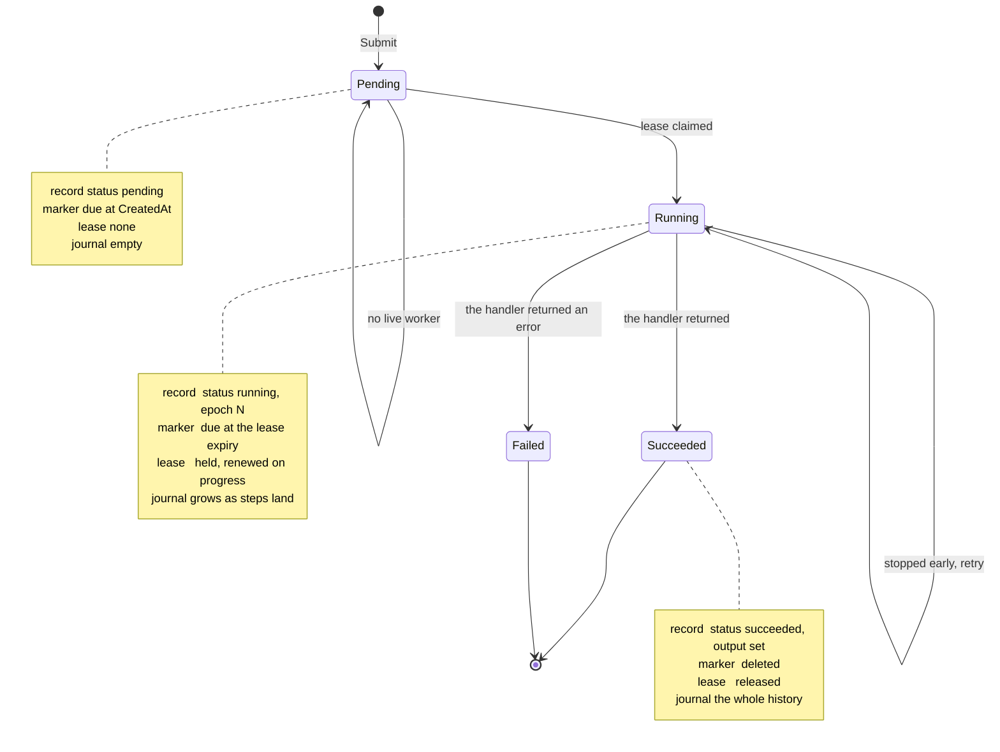
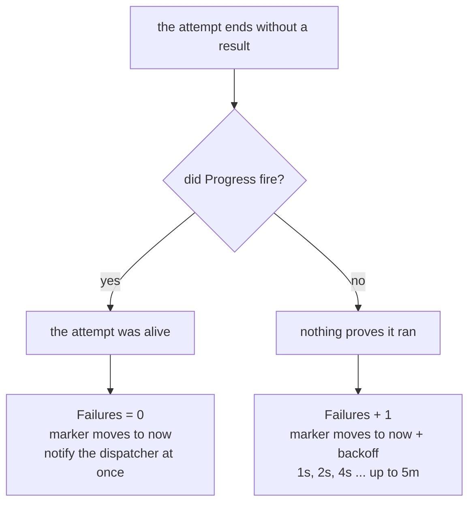
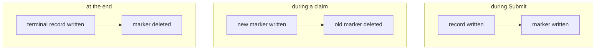

# The states of one invocation

An invocation moves through four states. The states are the easy part.
The hard part is what the four durable parts look like in each one, so
this page shows both together.

The four durable parts are the record, the wakeup marker, the lease, and
the journal. [What Keel stores](storage.md) describes each one.

Each arrow moves the marker, and some of them touch the counters:

| transition | the marker moves to | the record |
| --- | --- | --- |
| `Submit` | `CreatedAt`, so it is due at once | written, `pending` |
| no live worker | `now + 30s` | untouched. **No attempt is counted.** |
| lease claimed | the lease expiry | `running`, epoch set, `Attempts + 1` |
| stopped early, no progress | `now + backoff` | `Failures + 1` |
| stopped early, after progress | `now` | `Failures` reset to 0 |
| the handler returned | deleted | terminal, output or error set |

## Why the marker never sits still

In every state except the terminal ones, the marker has a due time that
means something different:

| state | the marker means |
| --- | --- |
| `Pending`, no worker | look again in 30 seconds, a worker may start |
| `Running` | this lease expires here, so take the work if I die |
| `Running`, after a failed attempt | wait out the backoff, then try again |

A terminal invocation has no marker at all. This is what makes the whole
design converge: an extra marker that comes due finds a terminal record
and deletes itself.

## The one question the retry loop asks

The `Running` self-arrow leaves the record at `running`, and this is on
purpose. An invocation never goes back to `pending`, because it has been
attempted.

The retry splits on one question only. Did the attempt make progress?

`Attempts` counts every run that reached a worker, and only an operator
reads it. `Failures` counts the runs in a row that proved nothing, and it
is what the backoff reads. A healthy long invocation that survives twenty
worker deploys keeps a `Failures` of 0 and waits for nothing.

## What a crash costs in each state

The order of the writes is chosen so that a crash is always recoverable.

| crash point | what is left | what it costs |
| --- | --- | --- |
| between `S1` and `S2` | a record with no marker | no scan finds it. A repeated submission writes the marker. |
| between `C1` and `C2` | two markers | the extra one finds a terminal record, or a held lease, and goes. |
| between `F1` and `F2` | a terminal record with a marker | the next scan reads the record and deletes the marker. |
| after the journal append, before the record write | a fenced journal | the invocation runs once more and replays to the same answer. |

Each pair is written in that order for one reason. The other order loses
work permanently. A marker deleted before the record is terminal leaves
an invocation that says `running` and that no scan will ever find again.
S3 has no transaction across two objects, so the order is the only tool.
