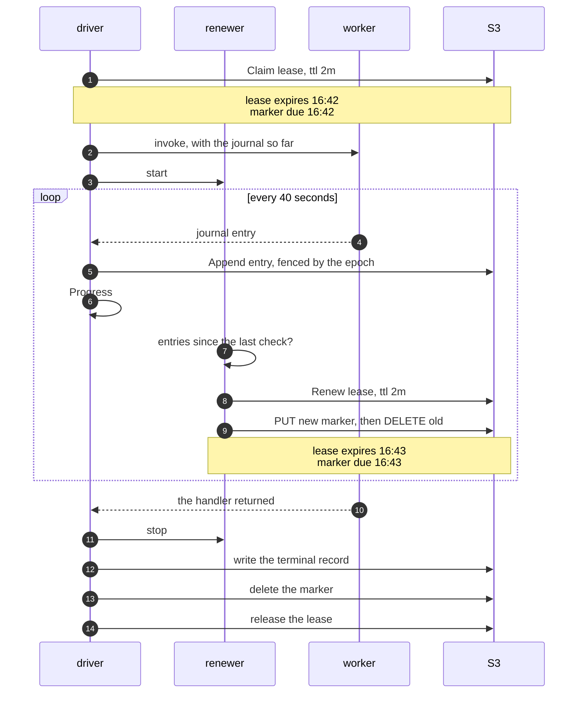
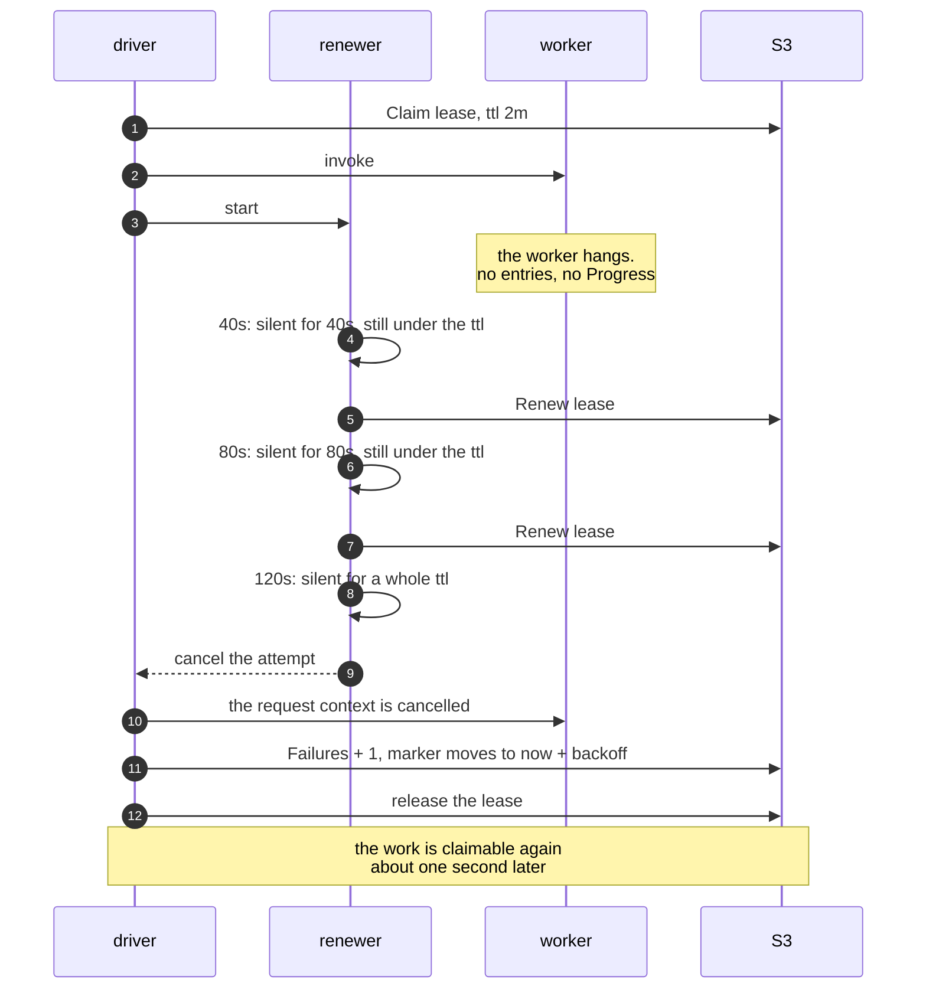
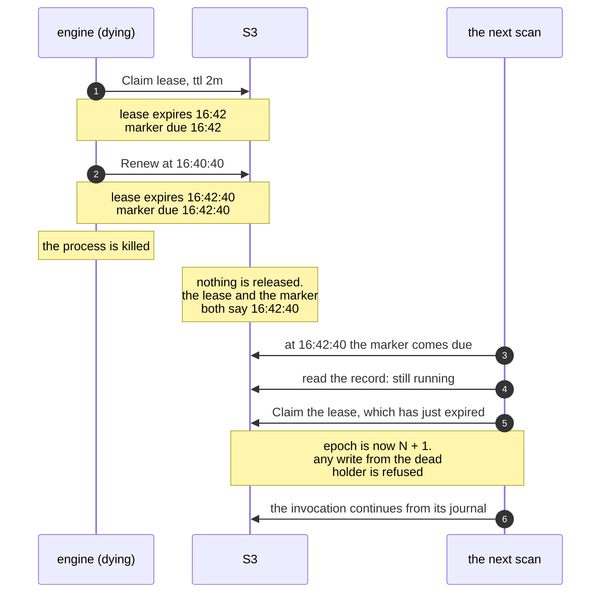

# A long run, second by second

A durable function may run for hours. The lease that protects it lasts
two minutes. This page shows how the two fit together, and what happens
when they stop fitting.

Three numbers drive everything here, and all three are defaults:

| | value | flag |
| --- | --- | --- |
| lease ttl | 2 minutes | `-lease-ttl` |
| renew every | ttl / 3, so 40 seconds | follows the ttl |
| stall limit | one whole ttl of silence | follows the ttl |

## The healthy case

The renewer holds the lease on evidence. Every journal entry the
worker produces calls `Progress`, and that is what earns the next 2
minutes. A timer alone would prove nothing.

Watch the lease expiry and the marker due time: they are the same
instant, and they move together.

The order at the end is fixed. Terminal record first, marker second,
lease last. Deleting the marker before the record is terminal would lose
the invocation for good.

## When the worker stops answering

Now the worker hangs. No journal entry arrives, so nothing calls
`Progress`. The renewer notices after one whole ttl of silence.

This is the reason the renewer reads evidence and not a clock. A
timer-based keepalive would renew this lease forever, and no other
engine could ever rescue the invocation.

## When the engine itself dies

Nothing runs the cleanup above, because there is no engine left to run
it. Recovery falls back to the one guarantee that needs no live process:

**The lease expiry and the marker due time are the same event.** That
single equality is what makes crash recovery need no recovery process, no
repair job, and no extra state. Work returns to the queue at the exact
moment it becomes legal to take it.

The cost of a crash is therefore bounded by `-lease-ttl`. A shorter ttl
recovers sooner and writes more renewals. Two minutes at 1000 concurrent
invocations is already about 50 storage writes per second, which is what
argues against going much shorter.

## The limit that is still open

`httpExecutor` only calls `Progress` when the worker replies, at the very
end of the call. So a handler that runs longer than the lease ttl over
plain HTTP is treated as a stall and cancelled.

That is correct for a streaming transport and premature for a
request and response one. The bidirectional stream, which reports each
journal entry as it happens, is what closes it.
