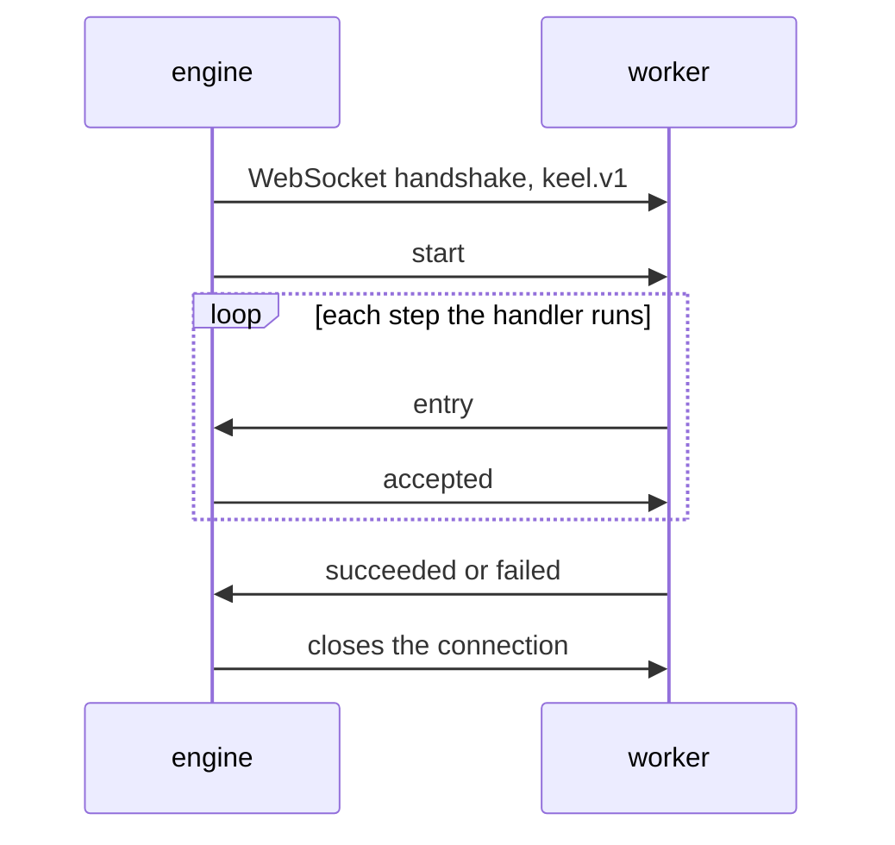

# The worker protocol, version 1

This page is the contract between a Keel engine and a worker. Write an
SDK in any language against it. The reference implementation is
`dispatch/ws.go` in this repository, and its tests pin the exact JSON
of every frame.

## The handshake

The engine opens one WebSocket connection per attempt, at the address
the worker announced at registration:

```
GET ws://<worker-address>/keel/v1/invoke
Sec-WebSocket-Protocol: keel.v1
```

The worker must reply with the same subprotocol:

```
Sec-WebSocket-Protocol: keel.v1
```

An engine must refuse a connection whose accepted subprotocol is not
one it offered. A worker that does not understand a version must not
accept the connection, so the engine can try a worker that does.

The rest of this page describes `keel.v1`.

## Frames

Both sides trade JSON text messages. Every frame is one object with a
`type` field, and unknown fields are ignored. Field names are exact. A
frame may carry one trailing newline, and a receiver must accept one.

Common fields, present when the type uses them:

| field | type | meaning |
| --- | --- | --- |
| `type` | string | which frame this is |
| `invocation_id` | string | the id the client chose at submission |
| `handler` | string | the handler name |
| `input` | any JSON | the invocation input |
| `journal` | array of entries | the whole recorded history |
| `entry` | one entry | the step the worker just ran |
| `step` | number | the step an `accepted` frame confirms |
| `output` | any JSON | the handler's output |
| `error` | string | why the attempt ended |

An entry is:

```json
{"step":0,"name":"charge","output":{...},"err":""}
```

`step` identifies the entry. It must be unique in a journal and stable
across a replay. `output` is present when the step succeeded, and `err`
is non-empty when the step failed. A failed step does not end the
invocation; the handler decides what a failed step means on the next
run.

## The order



1. The engine sends `start`, then waits. The journal in the start frame
   is the whole history, and a fresh invocation carries an empty array. The worker replays it: for each recorded step
   it returns the stored output instead of running the step again. This
   is what makes a resumed invocation skip work it already did.
2. The worker sends one `entry` frame per step, as the step finishes.
   The engine appends the entry durably and answers `accepted` for that
   step. **The worker must not send the next entry until the previous
   one is accepted**, and it must not reuse a step number that the
   journal already holds. The engine rejects both.
3. The worker ends with `succeeded`, which carries `output`, or
   `failed`, which carries a non-empty `error`. A `failed` frame ends
   the invocation as `failed`. The engine closes the connection after
   either one.

## The cancel frame

At any point after `start`, the engine may send:

```json
{"type":"cancel","error":"lease lost"}
```

The engine sends this when it can no longer hold the lease, or when a
client cancels the invocation. The worker must stop the handler soon
and close the connection. It sends nothing back. The engine does not
wait for a reply, and the attempt ends on the engine side whether the
worker stops or not.

## Rules for an SDK

- Send nothing before `start` arrives.
- One connection serves one attempt. Do not reuse it.
- A journal replay is deterministic. The same step number and name must
  produce the same work, so a resumed invocation reaches the same
  answer.
- Ignore unknown fields in every frame.
- Treat an unknown `type` as a protocol error, and close the
  connection. The engine does the same to the worker.
- After the engine closes the connection, the attempt is over. The
  engine may start the invocation again on a new connection, from the
  journal it has.

## How the protocol may change

Inside `keel.v1`, changes are additive only: a new optional field, or a
new frame type the receiver may ignore only if it never needs it. A
field never changes its meaning, and a frame never changes its order.

A change that breaks any of that becomes `keel.v2`, and the engine
offers it in the handshake beside `keel.v1`. A worker accepts the
highest version it supports and refuses the rest.
